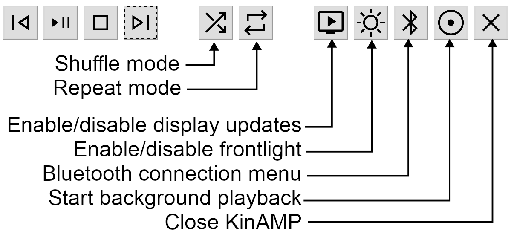

KinAMP - It really whimps the llama's ass!
==========================================


Kinamp is a native music player developed for jailbroken Kindles (Firmware 5.16+).

Supported audio formats:
- MP3
- FLAC
- WAV

Features
--------

- Fully native fast (C++ and GTK2) interface
- Simple to use
- Interface optimized for eink displays (minimal redraws to save battery)
- Low power consumption (4-5% per hour with frontlight and display updates off)
- Fast access to Bluetooth and frontlight settings
- Background mode to continue listening while reading.
- Uses [miniaudio](https://github.com/mackron/miniaudio) library for decoding.
- Uses the integrated GStreamer library for output
- No other dependencies

Useage
------



### Using background mode

- Start KinAMP and build your desired playlist.
- Click the *Background* button (with the circles, next to close). KinAMP will close and background playback will start
- To stop background playback, click the KinAMP booklet again.

Installation
------------

Download the latest release and unzip it to the root of the Kindle. Start it from KUAL or from the home screen.

Building
--------

Install the kox toolchain, clone the GIT repo and adapt it to your paths in the armhf-toolchain.cmake file.

```
git clone --recurse-submodules https://github.com/kbarni/KinAMP
cd kinamp
mkdir build
cd build
cmake .. -DCMAKE_TOOLCHAIN_FILE=armhf-toolchain.cmake
```

License
-------

This program is free software: you can redistribute it and/or modify it under the terms of the **GNU General Public License** as published by the Free Software Foundation, either version 3 of the License, or (at your option) any later version. This program is distributed in the hope that it will be useful, but WITHOUT ANY WARRANTY; without even the implied warranty of MERCHANTABILITY or FITNESS FOR A PARTICULAR PURPOSE. See the GNU General Public License for more details. You should have received a copy of the GNU General Public License along with this program. If not, see <http://www.gnu.org/licenses/>.
